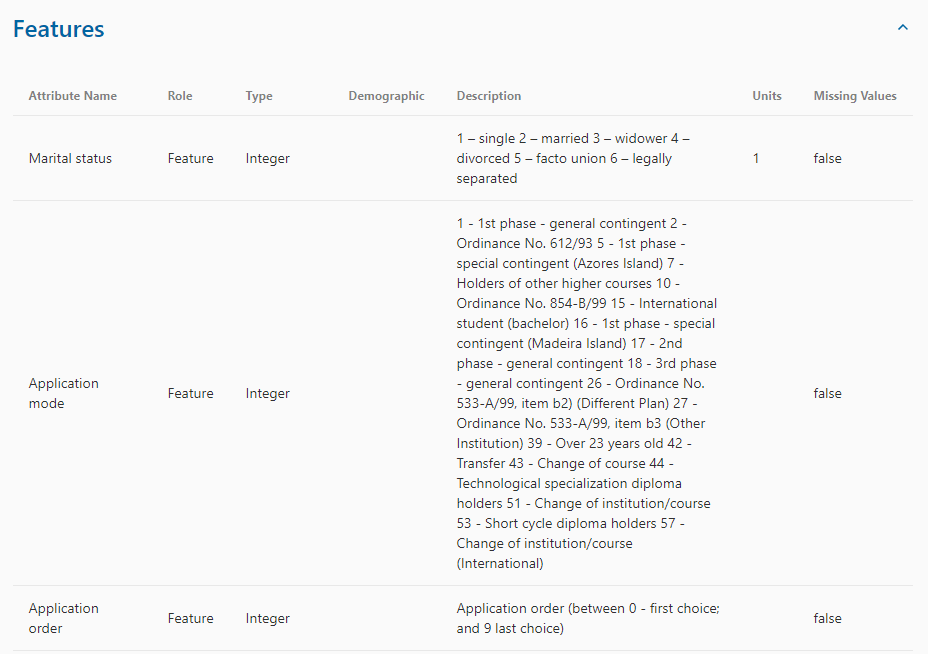
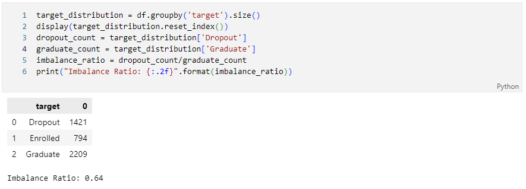
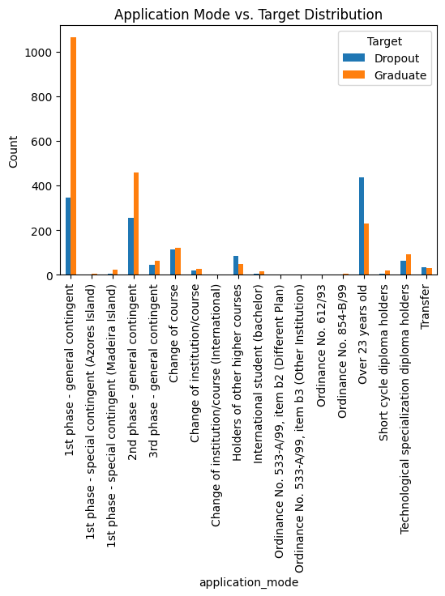
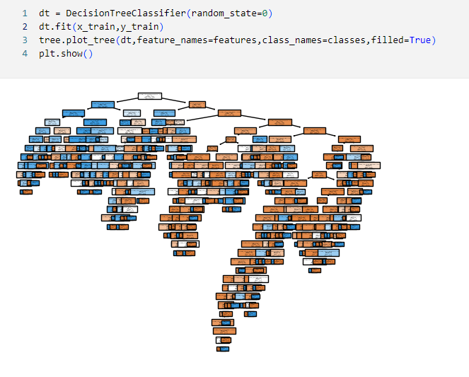
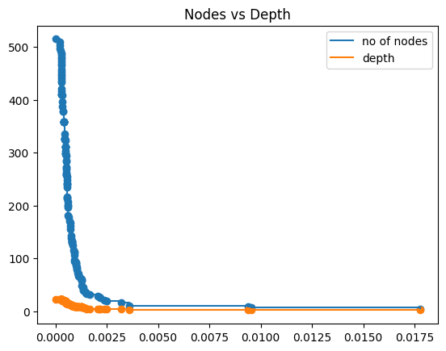
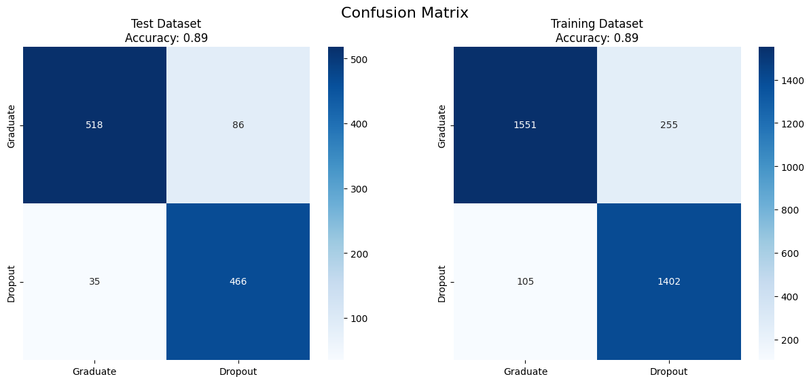

# Abstract
This paper explores the predictive capabilities of Decision Tree and Random Forest Classifier models in determining student dropout rates and academic success. It ensures data integrity through preliminary quality checks and balances target class distribution via the SMOTE technique. The study showcases the efficacy of pre-pruning and post-pruning in enhancing decision tree model generalization, while Random Forest reduces overfitting and provides robust generalization compared to standalone decision trees. Prediction results and algorithm performance measures were analyzed, and visualized for comparison and discussion.

**Keywords:** Academic Performance, Preliminary Data QA, Class Imbalance, Prediction, Decision Tree, Random Forest

# Introduction

In recent years, the application of predictive analytics in the field of education has gained substantial traction, revolutionizing the way institutions approach student success and retention. This paper delves into the realm of educational predictive modeling, specifically focusing on the prediction of student dropout rates and academic achievements using Decision Tree and Random Forest Classifier models. These models are adept at capturing complex interactions and non-linear relationships within the data, providing a holistic view of the multifaceted factors that impact student success. The inherent interpretability of Decision Trees further allows educators and researchers to gain insights into the decision-making process of the model, shedding light on the most influential attributes affecting outcomes. Random Forest, on the other hand, leverages an ensemble approach to aggregate predictions from multiple decision trees, mitigating overfitting and enhancing generalization capabilities. With the wealth of data available from student information systems and learning management platforms, machine learning techniques offer a promising avenue to unravel the intricate web of factors influencing student outcomes. By harnessing the power of these models, educators and administrators can gain valuable insights into the underlying patterns that contribute to student success or lead to attrition. This study highlights the potential of machine learning algorithms to decipher complex relationships among various predictors and provides a foundation for crafting effective interventions and strategies to enhance educational outcomes. Through an exploration of decision tree-based methodologies, this research aims to contribute to the advancement of data-driven strategies for fostering student achievement and reducing dropout rates in educational institutions. 

# Research Methodology

## Dataset
The dataset used in this project is used from the UCI Machine Learning repository. It contains 4424 records each containing 37 attributes with no missing values. Each record is a single student’s details like personal status, application mode, course, attendance shift, previous qualifications, family background, and curricular units in the first two semesters. Additionally, each record also has its economic indexes like the unemployment rate, inflation rate, and GDP. The target column is the status of the student like enrolled, dropout, and graduate. With the dataset, only dropout and graduate student data will only be fit in the machine learning model. 

Most of the values of the feature are already encoded with categorical values. The dataset source also provided the categorical values for those attributes.

This Data is extracted from the web source and saved as a code_reference file in the dataset.

## Preliminary Data QA
To ensure accurate and unbiased data for better model performance, preliminary quality checks are conducted before data processing. This reduces the risk of flawed predictions due to errors or inconsistencies in the dataset. The checks cover table structure, variable types, null values, and count calculations. 

Figure: Dataset Verbose Info
After the verbose data checks, null values were verified to ensure data completeness. It was found that there were no missing values in the dataset. 

Key descriptive statistics such as mean, count, standard deviation, and percentiles were computed and analyzed in the data frame at a later stage.

## Data Preprocessing

In Data preprocessing, data is cleaned, transformed, and organized to ensure the quality and suitability for machine learning and analysis tasks to enhance accuracy and reliability. 

### Imbalance Ratio

The imbalance Ratio is a measure of how skewed the class proportions are in a classification dataset. It is defined as the ratio of the number of instances in the majority class to the number of instances in the minority class. 

Taking count from the figure above, the imbalance ratio is calculated.

The analysis of the imbalance ratio between the dropout and graduate classes revealed a ratio of 0.64. Although this ratio does not reach the threshold for being considered extreme, it does indicate a subtle imbalance within the dataset. 

To balance out the dataset, samples based on the existing ones were created using SMOTE technique. It is a method to generate new samples for the minority class in an imbalanced dataset by creating synthetic examples based on the existing ones. It works by finding the k-nearest neighbors of a minority sample and randomly choosing one of them. Then, it creates a new sample along the line connecting the two samples. This way, it can balance the dataset and improve the classifier’s performance.

- https://machinelearningmastery.com/smote-oversampling-for-imbalanced-classification/
- https://www.turing.com/kb/smote-for-an-imbalanced-dataset

Before moving to oversampling the dataset, the features and target values were separated.

The dataset is balanced to counter skewed class distributions effectively. The count of dropouts is now equal to the count of graduates.

### Split Dataset to train and test data

Finally, to gauge model performance accurately, the dataset is split into train and test subsets, ensuring a comprehensive approach to data preparation for subsequent stages of analysis and modeling.

## Exploratory Data Analysis

To understand data patterns, relationships, and anomalies, it is crucial to conduct Exploratory Data Analysis (EDA) using visualization and statistical techniques. As most columns are encoded, a reference dataset is necessary to comprehend the data.

The initial step in the EDA process is to examine the correlation matrix for all features. This matrix offers valuable insights into the associations and relationships between variable pairs in a dataset.

The overview of all the features becomes hard to read. So the features were divided into different groups to look for their relationships.

After the correlation matrix, Features vs Target Distribution and box plot were analyzed for the datasets. Following are some important insights from the data.

# Model Selection and Tunning

On the preprocessed data, classification algorithms like decision trees and random forests were used. 

## Decision Tree

A decision tree is a supervised machine-learning algorithm that uses a tree-like structure to make decisions based on rules and outcomes. It can be used for both classification and regression tasks. 

For classification, the main idea is to split the data into subsets that have the highest purity or homogeneity of the target class. This can be done by using different metrics such as entropy, gini index, or information gain1.

The main idea of the decision tree is to split the data into subsets that have the highest purity or homogeneity of the target class. This can be done by using different metrics such as entropy, gini index, or information gain. One of the most common metrics for splitting a node in a classification tree is entropy. Entropy measures the uncertainty or impurity of a node. It is calculated as: `entropy_formula` where pi​ is the probability of class i in the node, and c is the number of classes.

The lower the entropy, the more pure or homogeneous the node is. The goal is to find the best split that minimizes the entropy of the child nodes.

Another common metric for splitting a node in a classification tree is information gain. Information gain measures the reduction in entropy after a split. It is calculated as: `Information_gain` where k is the number of child nodes, nj​ is the number of samples in child node j, n is the total number of samples in the parent node, and Entropy parent​ and Entropy childj​​ are the entropy of the parent and child nodes respectively.

The higher the information gain, the more information is gained by splitting the node. The goal is to find the best split that maximizes the information gain in the decision tree.

- https://scikit-learn.org/stable/modules/tree.html
- https://www-users.cse.umn.edu/~kumar001/dmbook/ch4.pdf
- https://www.datascienceprophet.com/understanding-the-mathematics-behind-the-decision-tree-algorithm-part-i/

A decision tree is a flow chart-like structure with the if-else condition. The top node is the root node, which starts the question from the root node and then moves through the tree branches according to which groups they belong to until they reach a leaf node.

The sci-kit learn module is used to implement a decision tree in Python. Upon implementing that, a DecisionTreeClassifier was created with the training dataset.

This decision tree has a high depth. The root depth of a decision tree is the length of the longest path from the root to a leaf. This decision tree shows it is highly complex and non-linear. Decision Trees are more prone to overfitting when they grow too deep or complex and capture the noise or outliers in the training data.

Looking into the confusion matrix of the decision tree, the accuracy for the training dataset is 1, and the test dataset is 0.89. This is a case of overfitting. This can result in poor generalization and performance on the test or validation data. Some of the common solutions to overfitting for decision trees are preprunning/early stopping and postprunning.

### Preprunning/Early Stopping

Pre-pruning is a technique to prevent the tree from reaching its full depth or complexity, where it may overfit the training data and capture the noise or outliers. By stopping the tree earlier, it can produce more generalizable and simpler rules that can perform better on new or unseen data. This can be achieved by tuning the hyperparameters before the training process to limit the growth of the tree. It involves setting a threshold or a condition that stops the tree-building process when it is reached, such as:
- The maximum depth of the tree
- The minimum number of samples required to split an internal node
- The minimum impurity decrease for a split
- The maximum number of leaf nodes

- https://www.kdnuggets.com/2022/09/decision-tree-pruning-hows-whys.html
- https://deepchecks.com/question/how-to-avoid-overfitting-in-a-decision-tree/

For Preprunning, GridSearchCV was used. GridSearchCV is a technique used in machine learning to search and find the optimal combination of hyperparameters for a given model. GridSearchCV takes a dictionary that describes the parameters that could be tried on a model to train it, and then exhaustively considers all possible combinations of those parameters. It then selects the best combination of parameters that maximizes the scoring metric and returns the optimal model.

- https://www.analyticsvidhya.com/blog/2021/06/tune-hyperparameters-with-gridsearchcv/
- https://www.mygreatlearning.com/blog/gridsearchcv/

Various parameters were passed on the GridSearchCV which gave the optimal parameter for the decision tree. The optimal parameters is `{'max_depth': 4, 'min_samples_leaf': 1, 'min_samples_split': 3}`

The overfitting issue is resolved only by using preprunning. The new confusion matrix shows the test and training dataset is now balanced.  

### Post Prunning/Backward Pruning

Post-pruning is a technique that simplifies a decision tree model by removing branches that are not useful or relevant. This technique is applied after the model is fully grown, meaning it has reached its maximum depth or complexity. The goal of post-pruning is to reduce the variance and improve the generalization of the model, which may overfit the training data and perform poorly on new or unseen data.

Post-pruning works by replacing nodes and subtrees with leaves, based on some criteria or measure, such as:

- The error rate of the subtree versus the leaf
- The confidence interval of the error rate
- The minimum description length principle
- The cost-complexity trade-off

- https://www.kdnuggets.com/2022/09/decision-tree-pruning-hows-whys.html

Cost-complexity pruning path is calculated for the decision tree. The cost_complexity_pruning_path method of the DecisionTreeClassifier class computes the path and returns ccp_alphas and impurities array. The ccp_alphas array contains the effective values of α for each subtree in the path, starting from zero (the full tree) and increasing until the tree is pruned to a single node.

- https://www.projectpro.io/recipes/do-cost-complexity-pruning-decision-tree-classifier

After calculating the ccp_alphas, various classifiers were tested in scatterplot.

Upon examining both figures, it's evident that the nodes and depth exhibit their most favorable characteristics within the range of CCP alpha values between 0.0025 and 0.005. Similarly, when considering accuracy, the CCP alpha value of 0.005 consistently corresponds to both the training and testing accuracy metrics.

using ccp_alpha=0.005, the overfitting is resolved.

## Random Forest

Another approach to solve overfitting in Decision trees is by using an ensemble method like a random forest. A decision tree is sometimes unstable and cannot be reliable as an alteration in data can cause a decision tree to go in a bad structure which may affect the accuracy of the model. Random Forest combines multiple Decision Trees by training each tree on a random subset of the data and features. The trees in a random forest are trained using the bagging method, which means that each tree is built from a random subset of the features and a random sample of the data with replacement. This way, the trees are not independent of each other, but they are diverse enough to reduce the variance and improve the accuracy of the predictions. This ensemble averaging helps to reduce the risk of overfitting. Since each tree in the forest is exposed to different subsets of the data, the collective prediction of the forest tends to be more generalized and less prone to capturing noise present in the data.

- https://crunchingthedata.com/when-to-use-random-forests/
- https://careerfoundry.com/en/blog/data-analytics/what-is-random-forest/
- https://medium.com/accelerated-analyst/practical-application-of-machine-learning-random-forests-for-business-problems-99dde574c0bc

Upon examining an un-tuned random forest classifier, some overfitting was observed. Although not as severe as in a decision tree, overfitting was still present. To address this issue, a grid search with cross-validation can be performed to determine the optimal hyperparameters, as was done with the decision tree. 

The optimal hyperparameter for the dataset is: `{'max_depth': 20, 'n_estimators': 50}`

By using the optimal hyperparameter values, the overfitting problem can be resolved.

# Model Evaluation
The Receiver Operating Characteristic (ROC) curve and its associated area under the curve (AUC) provide valuable insights into the performance of a binary classification model, such as a Decision Tree. The AUC ranges from 0 to 1, where a higher value indicates better classification performance. 

ROC (Receiver Operating Characteristic) curve is a graphical representation of the performance of a binary classifier, which plots the true positive rate (TPR) against the false positive rate (FPR) for different values of a decision threshold. AUC (Area Under the Curve) is a scalar value that summarizes the ROC curve by measuring the area under it. The Receiver Operating Characteristic (ROC) curve and its associated area under the curve (AUC) provide valuable insights into the performance of a binary classification model. ROC and AUC analysis is required for decision trees (unpruned, prepruned, and postpruned) because it can help to compare the performance of different decision trees or other classifiers on the same dataset. The AUC ranges from 0 to 1, a higher AUC indicates a better classifier that can discriminate between the positive and negative classes more accurately. 

## Decision Trees (Unprunned, Preprunned, Prunned)

This graph illustrates the impact of pruning on the performance of a decision tree. It demonstrates how pruning affects the balance between true positive rate (TPR) and false positive rate (FPR), and whether it enhances or diminishes overall performance. In comparison to the unpruned decision tree, both the pre-pruned and post-pruned decision trees have a slightly higher area under the curve (AUC) value, indicating that they are better at distinguishing between positive and negative instances. This may lead to better generalization.

## Random Forest and Decision Trees 

Random Forest consistently exhibited high accuracy on both the training and test datasets. Furthermore, it consistently achieved impressive Area Under the Curve (AUC) scores. Considering the dataset at hand, it becomes evident that prepruned decision trees and Random Forest models emerge as the most promising alternatives. These models not only achieve elevated levels of accuracy but also sustain robust AUC performance. This suggests that their inherent ability to handle complex relationships within the data while avoiding overfitting is highly advantageous for the dataset in question. Thus, the combination of consistent accuracy, strong AUC scores, and effective management of model complexity makes prepruned decision trees and Random Forest stand out as optimal choices for this specific dataset. 

Although there may not be a significant difference in performance currently, the random forest could potentially perform better with larger datasets or more complex feature interactions. Since accuracy and AUC are equal for both models, the decision might come down to a trade-off between interpretability, model complexity, computational resources, and any future scalability needs. For better long-term performance and better generalization in the future, selecting the random forest may provide a competitive advantage. But if interpretability and limited computational resources are crucial, the pre-pruned decision tree may be the preferred option.

# Conclusion

In the rapidly evolving landscape of education, the integration of predictive analytics has redefined approaches to student success and retention. This study has delved into educational predictive modeling, focusing on student dropout prediction and academic achievement using Decision Tree and Random Forest Classifier models. By capturing intricate data interactions, these models offer insights into multifaceted factors influencing student outcomes. The Decision Tree's interpretability sheds light on influential attributes, while the Random Forest's ensemble approach enhances generalization. Rigorous data quality checks, preprocessing, and exploratory analysis lay the foundation for model evaluation. Pre-pruned Decision Trees and the Random Forest consistently exhibit promising results, balancing accuracy and AUC performance. The choice hinges on trade-offs between interpretability, complexity, resources, and future scalability. Overall, this research equips educators with data-driven insights to drive interventions and enhance educational outcomes proactively.

